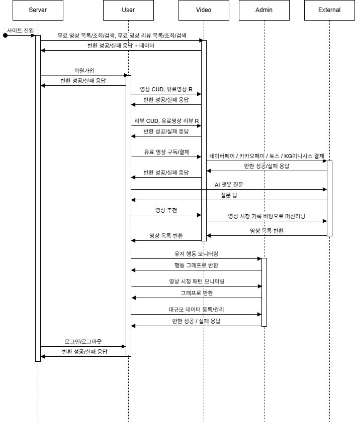
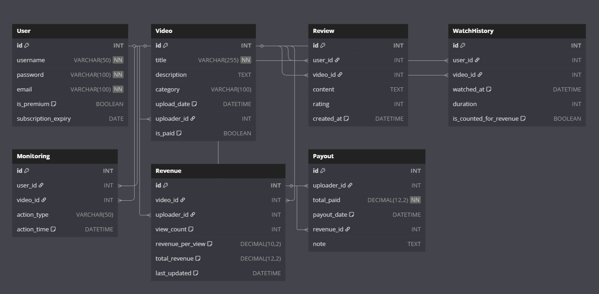

# Online Training

## Flow Chart

---

## 데이터베이스 설계

- **ERD**
    
    
    

<b>code</b>

    
    Project VideoService {
      database_type: "MySQL"
    }
    
    Table User {
      id INT [pk, increment]
      username VARCHAR(50) [not null, unique]
      password VARCHAR(100) [not null]
      email VARCHAR(100) [not null]
      is_premium BOOLEAN [default: false]
      subscription_expiry DATE
    }
    
    Table Video {
      id INT [pk, increment]
      title VARCHAR(255) [not null]
      description TEXT
      category VARCHAR(100)
      upload_date DATETIME [default: `CURRENT_TIMESTAMP`]
      uploader_id INT [ref: > User.id]
      is_paid BOOLEAN [default: false]
    }
    
    Table Review {
      id INT [pk, increment]
      user_id INT [ref: > User.id]
      video_id INT [ref: > Video.id]
      content TEXT
      rating INT
      created_at DATETIME [default: `CURRENT_TIMESTAMP`]
    }
    
    Table WatchHistory {
      id INT [pk, increment]
      user_id INT [ref: > User.id]
      video_id INT [ref: > Video.id]
      watched_at DATETIME [default: `CURRENT_TIMESTAMP`]
      duration INT
      is_counted_for_revenue BOOLEAN [default: true]
    }
    
    Table Monitoring {
      id INT [pk, increment]
      user_id INT [ref: > User.id]
      video_id INT [ref: > Video.id]
      action_type VARCHAR(50)
      action_time DATETIME [default: `CURRENT_TIMESTAMP`]
    }
    
    Table Revenue {
      id INT [pk, increment]
      video_id INT [ref: > Video.id]
      uploader_id INT [ref: > User.id]
      view_count INT [default: 0]
      revenue_per_view DECIMAL(10,2) [default: 100.00]
      total_revenue DECIMAL(12,2) [default: 0.00]
      last_updated DATETIME [default: `CURRENT_TIMESTAMP`]
    }
    
    Table Payout {
      id INT [pk, increment]
      uploader_id INT [ref: > User.id]
      total_paid DECIMAL(12,2) [not null]
      payout_date DATETIME [default: `CURRENT_TIMESTAMP`]
      revenue_id INT [ref: > Revenue.id]
      note TEXT
    }

  
 

  
<b>MySQL용 DDL (Data Definition Language)</b>

    CREATE TABLE User (
        id INT AUTO_INCREMENT PRIMARY KEY,
        username VARCHAR(50) NOT NULL UNIQUE,
        password VARCHAR(100) NOT NULL,
        email VARCHAR(100) NOT NULL,
        is_premium BOOLEAN DEFAULT FALSE,
        subscription_expiry DATE
    );
    
    CREATE TABLE Video (
        id INT AUTO_INCREMENT PRIMARY KEY,
        title VARCHAR(255) NOT NULL,
        description TEXT,
        category VARCHAR(100),
        upload_date DATETIME DEFAULT CURRENT_TIMESTAMP,
        uploader_id INT,
        is_paid BOOLEAN DEFAULT FALSE,
        FOREIGN KEY (uploader_id) REFERENCES User(id)
    );
    
    CREATE TABLE Review (
        id INT AUTO_INCREMENT PRIMARY KEY,
        user_id INT,
        video_id INT,
        content TEXT,
        rating INT,
        created_at DATETIME DEFAULT CURRENT_TIMESTAMP,
        FOREIGN KEY (user_id) REFERENCES User(id),
        FOREIGN KEY (video_id) REFERENCES Video(id)
    );
    
    CREATE TABLE WatchHistory (
        id INT AUTO_INCREMENT PRIMARY KEY,
        user_id INT,
        video_id INT,
        watched_at DATETIME DEFAULT CURRENT_TIMESTAMP,
        duration INT,
        is_counted_for_revenue BOOLEAN DEFAULT TRUE,
        FOREIGN KEY (user_id) REFERENCES User(id),
        FOREIGN KEY (video_id) REFERENCES Video(id)
    );
    
    CREATE TABLE Monitoring (
        id INT AUTO_INCREMENT PRIMARY KEY,
        user_id INT,
        video_id INT,
        action_type VARCHAR(50),
        action_time DATETIME DEFAULT CURRENT_TIMESTAMP,
        FOREIGN KEY (user_id) REFERENCES User(id),
        FOREIGN KEY (video_id) REFERENCES Video(id)
    );
    
    CREATE TABLE Revenue (
        id INT AUTO_INCREMENT PRIMARY KEY,
        video_id INT,
        uploader_id INT,
        view_count INT DEFAULT 0,
        revenue_per_view DECIMAL(10,2) DEFAULT 100.00,
        total_revenue DECIMAL(12,2) DEFAULT 0.00,
        last_updated DATETIME DEFAULT CURRENT_TIMESTAMP,
        FOREIGN KEY (video_id) REFERENCES Video(id),
        FOREIGN KEY (uploader_id) REFERENCES User(id)
    );
    
    CREATE TABLE Payout (
        id INT AUTO_INCREMENT PRIMARY KEY,
        uploader_id INT,
        total_paid DECIMAL(12,2) NOT NULL,
        payout_date DATETIME DEFAULT CURRENT_TIMESTAMP,
        revenue_id INT,
        note TEXT,
        FOREIGN KEY (uploader_id) REFERENCES User(id),
        FOREIGN KEY (revenue_id) REFERENCES Revenue(id)
    );
    
  
 
    

---

## API URL

- **API 명세서**
    
    
    
    
    
    
    
    
    
    
    
    

<b>Swagger Yaml</b>
  
    
    openapi: 3.0.0
    info:
      title: Video Platform API
      version: 1.0.0
      description: 회원가입, 로그인, 영상 관리, 리뷰, 결제, AI 기능, 관리자 기능을 포함한 전체 API 명세서
    
    servers:
      - url: https://api.example.com/v1
        description: Production Server
    
    paths:
      /users/register:
        post:
          summary: 회원가입
          operationId: registerUser
          tags: [회원]
          requestBody:
            required: true
            content:
              application/json:
                schema:
                  type: object
                  required: [username, password, email]
                  properties:
                    username:
                      type: string
                    password:
                      type: string
                    email:
                      type: string
          responses:
            '201':
              description: 회원가입 성공
            '409':
              description: 아이디 중복
    
      /users/login:
        post:
          summary: 로그인
          operationId: loginUser
          tags: [회원]
          requestBody:
            required: true
            content:
              application/json:
                schema:
                  type: object
                  required: [username, password]
                  properties:
                    username:
                      type: string
                    password:
                      type: string
          responses:
            '200':
              description: 로그인 성공
            '401':
              description: 인증 실패
    
      /users/logout:
        post:
          summary: 로그아웃
          operationId: logoutUser
          tags: [회원]
          responses:
            '200':
              description: 로그아웃 성공
    
      /videos:
        post:
          summary: 영상 등록
          operationId: uploadVideo
          tags: [영상]
          requestBody:
            required: true
            content:
              application/json:
                schema:
                  type: object
                  required: [title, description, url]
                  properties:
                    title:
                      type: string
                    description:
                      type: string
                    url:
                      type: string
          responses:
            '201':
              description: 영상 등록 성공
    
        get:
          summary: 영상 검색 (제목 기반)
          operationId: searchVideos
          tags: [영상]
          parameters:
            - in: query
              name: title
              schema:
                type: string
              required: false
          responses:
            '200':
              description: 영상 목록 반환
    
      /videos/{videoId}:
        get:
          summary: 영상 상세 조회
          operationId: getVideo
          tags: [영상]
          parameters:
            - in: path
              name: videoId
              required: true
              schema:
                type: string
          responses:
            '200':
              description: 영상 정보 반환
    
        put:
          summary: 영상 수정
          operationId: updateVideo
          tags: [영상]
          parameters:
            - in: path
              name: videoId
              required: true
              schema:
                type: string
          requestBody:
            required: true
            content:
              application/json:
                schema:
                  type: object
                  properties:
                    title:
                      type: string
                    description:
                      type: string
          responses:
            '200':
              description: 수정 완료
    
        delete:
          summary: 영상 삭제
          operationId: deleteVideo
          tags: [영상]
          parameters:
            - in: path
              name: videoId
              required: true
              schema:
                type: string
          responses:
            '204':
              description: 삭제 완료
    
      /reviews:
        post:
          summary: 리뷰 작성
          operationId: writeReview
          tags: [리뷰]
          requestBody:
            required: true
            content:
              application/json:
                schema:
                  type: object
                  required: [videoId, content, rating]
                  properties:
                    videoId:
                      type: string
                    content:
                      type: string
                    rating:
                      type: integer
                      minimum: 1
                      maximum: 5
          responses:
            '201':
              description: 리뷰 작성 성공
    
        get:
          summary: 리뷰 검색 (키워드 기반)
          operationId: searchReviews
          tags: [리뷰]
          parameters:
            - in: query
              name: keyword
              required: false
              schema:
                type: string
          responses:
            '200':
              description: 검색된 리뷰 목록 반환
    
      /reviews/video/{videoId}:
        get:
          summary: 영상별 리뷰 목록
          operationId: listReviewsByVideo
          tags: [리뷰]
          parameters:
            - in: path
              name: videoId
              required: true
              schema:
                type: string
          responses:
            '200':
              description: 리뷰 목록 반환
    
      /reviews/{reviewId}:
        get:
          summary: 리뷰 상세 조회
          operationId: getReview
          tags: [리뷰]
          parameters:
            - in: path
              name: reviewId
              required: true
              schema:
                type: string
          responses:
            '200':
              description: 리뷰 정보 반환
    
        put:
          summary: 리뷰 수정
          operationId: updateReview
          tags: [리뷰]
          parameters:
            - in: path
              name: reviewId
              required: true
              schema:
                type: string
          requestBody:
            required: true
            content:
              application/json:
                schema:
                  type: object
                  properties:
                    content:
                      type: string
                    rating:
                      type: integer
          responses:
            '200':
              description: 수정 완료
    
        delete:
          summary: 리뷰 삭제
          operationId: deleteReview
          tags: [리뷰]
          parameters:
            - in: path
              name: reviewId
              required: true
              schema:
                type: string
          responses:
            '204':
              description: 삭제 완료
    
      /payments/video:
        post:
          summary: 유료 영상 결제
          operationId: payForVideo
          tags: [결제]
          requestBody:
            required: true
            content:
              application/json:
                schema:
                  type: object
                  required: [userId, videoId, paymentMethod]
                  properties:
                    userId:
                      type: string
                    videoId:
                      type: string
                    paymentMethod:
                      type: string
          responses:
            '200':
              description: 결제 성공
            '402':
              description: 결제 실패
    
      /payments/subscribe:
        post:
          summary: 구독 서비스 결제
          operationId: subscribe
          tags: [결제]
          requestBody:
            required: true
            content:
              application/json:
                schema:
                  type: object
                  required: [userId, planId]
                  properties:
                    userId:
                      type: string
                    planId:
                      type: string
          responses:
            '200':
              description: 구독 성공
    
      /ai/chatbot:
        post:
          summary: 챗봇 질문 응답
          operationId: chatbotResponse
          tags: [AI]
          requestBody:
            required: true
            content:
              application/json:
                schema:
                  type: object
                  required: [question]
                  properties:
                    question:
                      type: string
          responses:
            '200':
              description: 챗봇 응답 반환
    
      /ai/recommend:
        get:
          summary: 영상 추천
          operationId: recommendVideos
          tags: [AI]
          parameters:
            - in: query
              name: userId
              required: true
              schema:
                type: string
          responses:
            '200':
              description: 추천 영상 목록 반환
    
      /admin/monitoring/users:
        get:
          summary: 유저 행동 모니터링
          operationId: monitorUsers
          tags: [관리자]
          responses:
            '200':
              description: 유저 모니터링 데이터 반환
    
      /admin/monitoring/videos:
        get:
          summary: 영상 시청 패턴 모니터링
          operationId: monitorVideos
          tags: [관리자]
          responses:
            '200':
              description: 인기 영상 및 패턴 반환
    
      /admin/data:
        post:
          summary: 대규모 데이터 등록/관리
          operationId: manageData
          tags: [관리자]
          responses:
            '200':
              description: 데이터 처리 완료
    
      /admin/etl:
        get:
          summary: ETL 파이프라인 데이터 수집
          operationId: etlData
          tags: [관리자]
          responses:
            '200':
              description: 수집된 데이터 반환
    
      /admin/deploy:
        post:
          summary: 서비스 배포
          operationId: deployService
          tags: [관리자]
          responses:
            '200':
              description: 배포 성공
    

    

---

## Spring 기본 설계

### **유스케이스**

### **요구사항**

| 단계 | 분류 | 기능명 | 기능 상세 설명 |
| --- | --- | --- | --- |
| 1 | 회원 | 회원가입 | 아이디 중복 제외 회원 가입 기능 |
| 2 | 회원 | 로그인/로그아웃 | 아이디/비번 검증 후 로그인 & 로그아웃 |
| 3 | 영상 | 영상 등록 | 영상 정보를 등록 |
| 4 | 영상 | 영상 조회 | 영상 정보를 상세 조회 |
| 5 | 영상 | 영상 검색 | 제목 기반 영상 검색 |
| 6 | 영상 | 영상 수정 | 기존 영상 정보 수정 |
| 7 | 영상 | 영상 삭제 | 영상 정보 삭제 기능 |
| 8 | 리뷰 | 리뷰 작성 | 영상에 대한 사용자 리뷰 작성 |
| 9 | 리뷰 | 리뷰 목록 | 특정 영상에 대한 리뷰 목록 반환 |
| 10 | 리뷰 | 리뷰 조회 | 특정 리뷰 상세 조회 |
| 11 | 리뷰 | 리뷰 수정 | 기존 리뷰 수정 |
| 12 | 리뷰 | 리뷰 삭제 | 리뷰 삭제 기능 |
| 13 | 리뷰 | 리뷰 검색 | 키워드 기반 리뷰 검색 기능 |
| 14 | 결제 | 유료 영상 결제 | 유료 영상은 결제해야 시청 가능 |
| 15 | 결제 | 구독 서비스 결제 | 영상 구독 등 결제 기능 |
| 16 | AI | 챗봇 | LLM 기반 정보성 챗봇 질문 응답 |
| 17 | AI | 추천 시스템 | 시퀀셜 모델 기반 영상 추천 기능 |
| 18 | 관리자 | 유저 모니터링 | 이탈 시점 분석을 위한 사용자 행동 모니터링 |
| 19 | 관리자 | 영상 모니터링 | 인기 영상 확인 등 시청 패턴 모니터링 |
| 20 | 관리자 | 데이터 관리 | 유튜브 영상 등록, 회원 관리 등 대규모 데이터 처리 |
| 21 | 관리자 | 데이터 수집 | ETL 파이프라인을 통한 데이터 수집 및 활용 |
| 22 | 관리자 | 배포 | AWS EC2를 통한 배포 및 DNS 연결 |

### **화면설계**

---